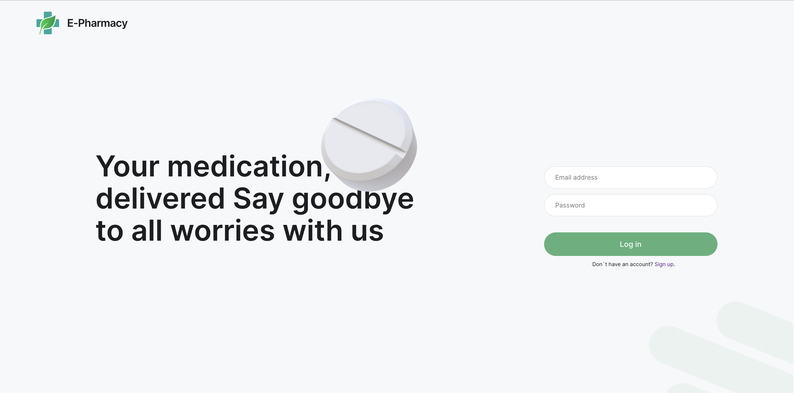

# 

---

## Dashboard for Medical Store

Цей проєкт є веб-додатком для сторінки
[Dashboard](https://admin-dashboard-seven-roan.vercel.app), яка відображає
інформацію про доходи, витрати та інші статистичні дані медичного магазину.
Проєкт складається з фронтенду, реалізованого на React з використанням Vite, та
бекенду, реалізованого на Node.js з використанням Express.js.

---

### Зміст

1. [Dashboard for Medical Store](#dashboard-for-Medical-Store)
2. 
3. 
4. 
5. 
6. 

---

### Встановлення

---

### Використання

---

### Конфігурація

## Фронтенд

## Бекенд

---

## Список технологій які були використані

## Список звстосовиних хуків
